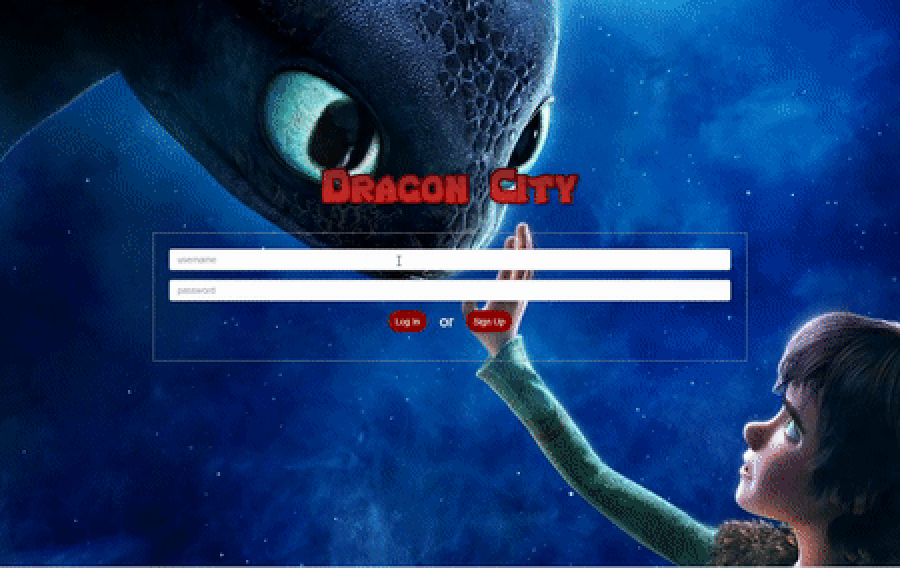
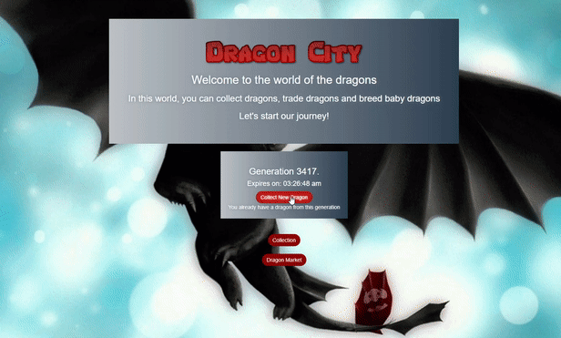
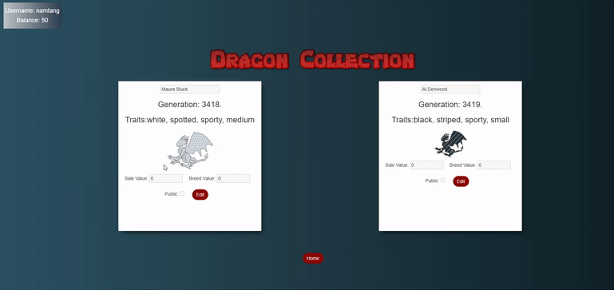
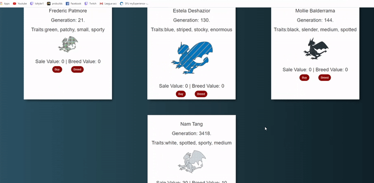
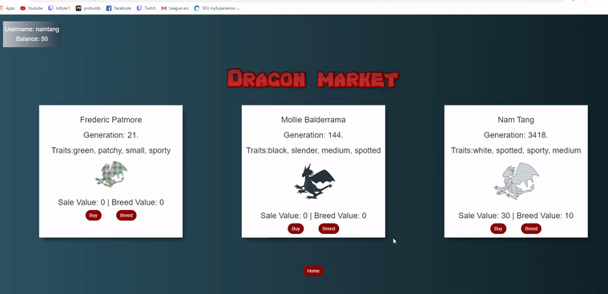

# Dragon City


1.Project description:
  - Dragon city is a full stack web application (PERN stacks) that allows users collect dragons. 
  - Dragon city contains the following functionality: Collecting Dragons from generations, Buy/Sell Dragons to other users and Breed baby dragons
  - Tech stack: React, Redux, Boostrap, NodeJS, ExpressJS, PostgreSQL
  
2.How to run:
  - Install all dependencies by ```npm-install``` in both backend folder and frontend folder
  - Run both backend server and frontend server at the same time by ```node bin/server.js``` and ```npm start``` 
  
3.Demo:
  - User Sign Up:
    
  - Collect dragons from generation, but users can only collect 1 dragon / generation
    
  - Edit a dragons stat and place it in the dragon market
    
  - Buy dragons at dragon market
  - 
  - Make baby dragon from a dragon at dragon market
    
